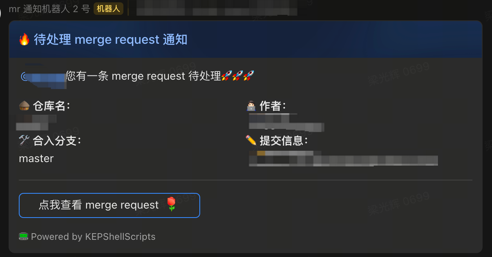
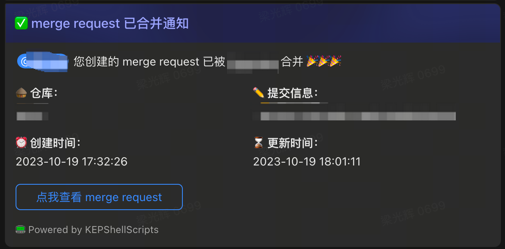
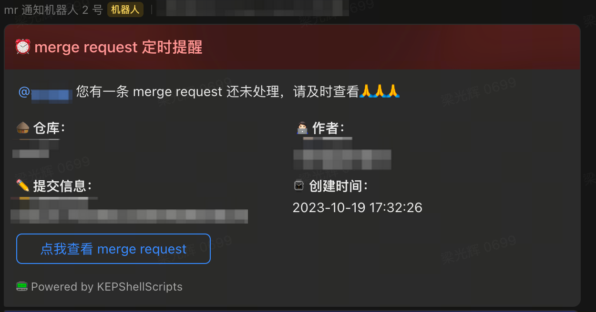

# Sirius

## MRServer

[merge request 脚本](https://github.com/Lguanghui/ShellScripts)的服务端实现，能够接受来自 Gitlab 的，由 merge request 事件触发的 webhook 数据（POST）。

如果是创建事件或者由脚本发出的创建请求，会将接口携带的数据存至数据库。

如果是合并事件，将向指定群聊发送飞书机器人消息，通知提出者已合并，并会删除对应的数据库数据。

服务器会在周一至周五的 10 点到 19 点，每隔半个小时在数据库中查找还未合并的 merge request，并向指定群聊发送机器人消息。

服务器环境配置：

- 系统：Debian 12
- 数据库：MariaDB
- Java Version: openjdk 17.0.8 2023-07-18
- Spring Boot: 3.1.4

### Todo

- [ ] 入库数据区分组件库和主工程。因为组件库并没有配置 Gitlab 的 webhook，webhook data 始终为空。但会有部分同学使用 createMR 在组件库创建 mr。
- [ ] 尝试使用间隔一天的定时任务清理数据库无效数据