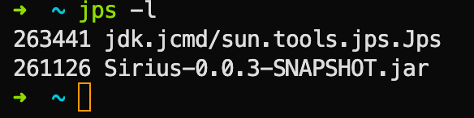

# Sirius

## 打包发版

### 输出 jar 包

在项目根目录输入指令：

```shell
./gradlew clean build
```

然后在 `build/libs` 里面找到相关的 jar 包，将 jar 包上传至服务器。

### 服务器部署

在服务器相关目录下输入指令：

```shell
nohup java -jar Sirius-0.0.x-SNAPSHOT.jar >> log.txt &
```

`nohup` 表示进程在 ssh 关闭后依然能够存活，部署后日志将被输出到 `log.txt` 文件。

关于输出重定向：
- `>` 输出重定向：会将原来的文件内容覆盖

- `>>` 追加：不会覆盖原来文件的内容，而是追加到文件的尾部

### 停止服务

终端中输入下面指令获取当前正在运行的 java 进程：

```shell
jps -l
```



找到想要停止的服务进程，执行下面指令将其终止运行

```shell
kill -9 261126
```

> 打包部署参考链接：
> https://blog.csdn.net/LeegooWang/article/details/82424362
> https://juejin.cn/post/7232160630399320124
> [确保SSH退出登陆后进程继续在后台运行](https://dcrozz.github.io/2017/03/19/%E8%BD%AC%E8%BD%BD-%E7%A1%AE%E4%BF%9DSSH%E9%80%80%E5%87%BA%E7%99%BB%E9%99%86%E5%90%8E%E8%BF%9B%E7%A8%8B%E7%BB%A7%E7%BB%AD%E5%9C%A8%E5%90%8E%E5%8F%B0%E8%BF%90%E8%A1%8C/)

### Bump Version

大版本用 major，中版本用 minor，小版本（补丁）用 patch

```shell
bump-my-version bump minor
```

## JVM 调优

项目部署后发现内存占用比较高的话，可以在部署时添加几个参数，限制和优化内存占用。

> 参考链接：
> [JVM的GC 参数为什么要这么命名：xms、xss、xmn和xmn](https://blog.csdn.net/kusedexingfu/article/details/103744202)
> [JVM调优总结 -Xms -Xmx -Xmn -Xss](https://cloud.tencent.com/developer/article/2052020)
> [优化Spring程序内存占用](https://juejin.cn/post/7205162789156814906)
